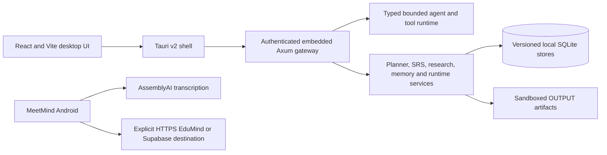

# EduMind

EduMind is a local-first AI student operating system that connects a confirmed weekly schedule, source-aware class notes, exam practice, spaced repetition, research evidence, routines, and student-owned project records in one desktop application.

- **OpenAI Build Week category:** Education
- **Version:** 0.1.0
- **Repository:** [github.com/Hasan3301-cyber/EduMind](https://github.com/Hasan3301-cyber/EduMind)
- **Primary platform:** Windows desktop (React, Tauri v2, Rust, and SQLite)
- **Companion:** MeetMind for Android lecture recording and transcript delivery

## The problem

Students commonly split their work across calendars, note generators, flashcard apps, research tools, and chat assistants. Those tools rarely share a trustworthy source of schedule or study state. The result is duplicated work, ungrounded AI output, and automated suggestions that can silently conflict with a student's actual commitments.

## The solution

EduMind treats the student as the final decision-maker. The Planner is the canonical schedule; Routine Coach can propose blocks but cannot silently apply them. Class Notes keeps supplied resources primary and retrieves transcript evidence as additional context. Exam Practice validates generated artifacts and never presents generated questions as official exam material. Study Review uses one deterministic scheduler for both grade previews and persisted review dates. Research keeps source-level provenance, reports retrieval gaps, and validates claims against selected evidence.

Important writes and imports remain reviewable, provider credentials stay outside source files, and deterministic local behavior remains available when no AI provider is configured.

## Product tour

- **Home dashboard:** today’s priorities, focus timer, system readiness, and a Monday-to-Sunday view containing only confirmed Planner blocks.
- **Student Planner:** manual schedule editing plus review-and-confirm timetable image import.
- **Routine Coach:** read-only access to canonical planner context and confirmation-gated proposed study blocks.
- **Class Notes:** source-aware structured notes, deterministic transcript prefetch, and safe HTML/PDF export beneath the configured output directory.
- **Exam Practice:** validated practice-set artifacts with objective, difficulty, evidence, answer explanations, and optional SRS cards.
- **Study Review:** durable cards, review history, and backend-derived consequences for each possible grade.
- **Research:** focused discovery, selected full-text ingestion, project scope, notes, questions, claim validation, gap inspection, supervision, and BibTeX/RIS export.
- **Student OS:** personal operating cards and local project build logs with timestamp/tombstone merge semantics.
- **Group Study and memory views:** durable local rooms, bounded AI context, hybrid retrieval, graph exploration, and an accessible non-WebGL fallback.
- **MeetMind:** an Android companion that records lectures, transcribes through AssemblyAI, and sends reviewed transcripts only to an explicitly configured HTTPS destination.

## Why it is different

EduMind is not a collection of unrelated AI prompts. It uses typed gateway contracts, explicit tool allow-lists, bounded agent execution, transactional versioned databases, one canonical Student Page state, deterministic SRS scheduling, evidence-linked research, and confirmation gates around consequential changes. The installed desktop starts its own authenticated loopback gateway, so students do not need to run or expose a separate backend service.

## Quick start for judges

### Use a Windows bundle

Release builds produce both installers:

```text
edumind-tauri/src-tauri/target/release/bundle/msi/EduMind_0.1.0_x64_en-US.msi
edumind-tauri/src-tauri/target/release/bundle/nsis/EduMind_0.1.0_x64-setup.exe
```

Install one bundle, launch EduMind, and select **Continue offline** to inspect the deterministic local experience. The unsigned development bundles may trigger Windows SmartScreen until a production signing certificate is configured.

### Run from source

Prerequisites:

- Windows 10 or newer with WebView2
- Node.js 22 and npm
- Rust 1.93 or newer
- Visual Studio C++ Build Tools required by Tauri

```powershell
cd edumind-tauri
npm ci
npm run tauri -- dev
```

For a production bundle:

```powershell
cd edumind-tauri
npm ci
npm run tauri -- build
```

AI generation is optional for repository evaluation. To enable it, open **Admin**, configure an OpenAI-compatible HTTPS endpoint and model, save the API key to the native OS keychain, and test the connection. A loopback Ollama endpoint can be used without a key. Never commit provider credentials.

## Architecture



The gateway binds to an OS-assigned loopback port, creates a per-launch bearer token, and shares the endpoint only through a Tauri command. It records only coarse redacted operational telemetry: fixed event/category values, outcome, duration, and status code—never request paths, query strings, bodies, authorization headers, transcripts, or dynamic student identifiers.

## OpenAI Build Week development

### GPT-5.6

GPT-5.6 Sol was used through Kiro for repository-wide gap analysis, architecture and safety review, transactional SQLite migration design, canonical Planner/Routine ownership, Class Notes transcript retrieval, SRS preview consistency, Research and Exam Practice workflow completion, redacted telemetry, packaged-runtime lifecycle testing, release CI, dashboard/project-note review, and repeated Rust, desktop, browser, Android, and installer validation. Model output was treated as untrusted: changes were checked against typed contracts and validated with deterministic tests and production builds.

### Codex

**Submission evidence pending:** this workspace does not contain verifiable metadata from an official Codex session, so no Codex contribution is claimed here yet. Before submission, the entrant must use Codex for a genuine, non-trivial repository task, preserve an honest summary of what it changed or reviewed, run `/feedback` in that official Codex interface, and replace this paragraph with the factual contribution. The `/feedback` session ID belongs in the Devpost form unless the official instructions explicitly request it in the public repository.

## Privacy and safety

- Student databases, transcripts, recordings, generated artifacts, `.env` files, mobile properties, test reports, and signing files are excluded from source control.
- Provider keys are stored in the native keychain; example configuration contains no live credentials.
- Remote provider and research URLs require HTTPS; loopback HTTP is allowed only for local services.
- Agent tools are deny-by-default, resource-bounded, audited without content, and constrained by a write sandbox.
- Timetable imports, schedule changes, downloads, durable research edits, and external actions remain explicit user decisions.
- Research and wellbeing features provide study support, not medical, legal, or other professional advice.

## Validation

The repository defines and has exercised these release gates:

```powershell
cargo fmt --all -- --check
cargo test --workspace
cargo clippy --workspace --all-targets -- -D warnings

cd edumind-tauri
npm run lint
npm test
npm run test:safety
npx playwright test
cargo test --manifest-path src-tauri/Cargo.toml
npm run build
npm run tauri -- build

cd ../mobile
.\gradlew.bat :app:assembleDebug :app:lintDebug
```

The latest validated development pass completed 198 Rust workspace tests, 15 Tauri tests including a real embedded start/health/stop smoke, 28 desktop unit tests, Node safety checks, browser workflows, Android assembly/lint, and Windows MSI/NSIS packaging. See `docs/HARDENING.md` and `.github/workflows/ci.yml` for the authoritative release matrix.

## Known deployment inputs

Production distribution still requires external credentials and infrastructure that must not be committed: Windows and Android signing identities, optional AI/provider credentials, an updater endpoint and signed update manifests if auto-update is enabled, and explicitly configured MeetMind transcription/sync services.

## License

EduMind is available under the [MIT License](LICENSE).

## Configuration

`edumind/config.example.yaml` documents all currently supported gateway, model,
agent, routing, channel, memory, scheduler, tool, web, and security settings.
Validate it locally with:

```powershell
cargo run -p edumind -- --config edumind/config.example.yaml --check-config
```

Configuration supports `${ENVIRONMENT_VARIABLE}` expansion and `~` at the
start of filesystem paths. Sensitive values are redacted before configuration
is returned to future API clients.

## Memory Core

The Phase 3 memory core uses SQLite with FTS5 lexical retrieval, persisted
embeddings, deterministic hash embeddings for offline operation, optional
Ollama/OpenAI-compatible providers, exact cosine search, and deterministic
hybrid ranking. It is intentionally independent of network providers in tests.

## Memory Intelligence

Phase 14 adds scoped module memories (`private`, `module`, `cross_module`, and
`global`), advanced hybrid retrieval reranked with Jaccard/MMR, a derived
knowledge graph with connected communities, and source-linked local wiki pages.
Each write embeds the record and refreshes graph/wiki coverage without a network
dependency.

Use `POST /api/v1/memory/{search,list,get,store}`, `GET
/api/v1/memory/{stats,graph}`, `POST /api/v1/memory/{graph/search,
graph/neighbors,wiki/search}`, and `POST
/api/v1/modules/{module_id}/memory/{search,store,get,summary}`. Equivalent
non-versioned paths remain available locally. Authorized agents can use
`memory_search`, `memory_get`, `memory_store`, the `module_memory_*` tools,
`wiki_search`, `graph_search`, and `graph_neighbors` after explicit
allow-listing.

Hermes is disabled by default. When `memory.hermes.enabled` is set, the served
gateway runs a cooldown- and daily-cap-bounded local loop that derives smoothed
skill-confidence insights from memory metadata such as `skill` and `success`.
Its persisted history is available at `GET /api/v1/hermes/cycles`.

## Gateway Core

Start the local gateway with a validated configuration:

```powershell
cargo run -p edumind -- --config edumind/config.example.yaml
```

The gateway exposes `/health`, `/ready`, and a versioned WebSocket protocol at
`/ws`. It supports no-auth, fixed-token, and HS256 JWT authentication; enforces
the configured origin allowlist; and refuses a non-loopback no-auth bind unless
`EDUMIND_ALLOW_INSECURE_BIND=1` is explicitly set.

## Agent Runtime

The Phase 5 agent runtime resolves request, agent, and default models; persists
bounded SQLite conversation sessions; and runs a model/tool loop through typed
provider and executor interfaces. Tool use is fail-closed: an empty agent
allow-list always denies all tools, and the `safe` profile permits read-only
tools only. Every attempted execution is rate-limited and recorded in a bounded,
content-free audit log. Configured timeout, direct-run concurrency, subagent
concurrency, and spawn-depth limits are enforced before work proceeds.

## Runtime Tools

Phase 15 adds local artifact tools that all reuse the guarded process runner and
the configured write sandbox. Documents and slides persist their revision
history as HTML/SVG artifacts below `meta.data_dir/OUTPUT`; PDFs extract and
analyze locally; deterministic SVG study visuals work offline; and HTTPS image
downloads require a declared bounded image response. `latex_compile` stages a
standalone `.tex` source in a temporary directory and only copies its validated
PDF into `OUTPUT/latex`.

`tools.document_engine`, `tools.slide_engine`, and `tools.image_engine` are
optional external converters. Their configured command receives
`--input <staged-file> --output <staged-output> --format <format>` and is
resource-capped before its declared output is copied through the write sandbox.
`tools.notebooklm` and `tools.notebooklm_py` accept local HTTP MCP endpoints;
the Python bridge is preferred for supported ask/list/health calls and falls
back to the MCP endpoint when configured. Safe runtime availability is exposed
at `GET /api/v1/runtime/status`; NotebookLM health is available at
`GET /api/v1/runtime/notebooklm/health`.

Authorized agents can use `pdf_extract_text`, `pdf_analyze`, `doc_*`,
`slide_*`, `image_*`, `latex_compile`, and `notebooklm_*` only after those
tools are explicitly allow-listed and the active tool profile permits their
class.

### Class Notes exports

The desktop Class Notes workspace lets a student choose a relative folder
inside `OUTPUT/ClassNotes` before saving a generated note. For example,
`Semester 1/Calculus` saves a versioned HTML note directly at
`OUTPUT/ClassNotes/Semester 1/Calculus/ClassNotes_<topic>_<date>.html`, with a
separate provenance copy in its `sources` subfolder. The built-in artifact
service always supports this HTML export. PDF export is available only when
`tools.document_engine` is configured and enabled; its validated PDF is saved
in the chosen folder. Absolute paths, traversal segments, and unsupported
folder names are rejected, so notes cannot escape the approved output directory
or overwrite an existing export.

## Embedded Desktop and 3D Graphs

`edumind-tauri` is a single React/Vite application inside a Tauri v2 shell.
On launch, the shell creates an OS app-data directory, configures all SQLite
files and tool output beneath it, binds the Rust gateway to a loopback OS-assigned
port, creates a per-launch bearer token, and gives that endpoint only to the
frontend through `get_gateway_endpoint`. Closing or exiting the app sends a
graceful shutdown signal to the in-process gateway. Windows bundles are
configured for MSI and current-user NSIS installers; no standalone backend
startup is required.

### Desktop LLM setup

In the desktop app, open **Admin** and use **Study assistant provider** to
enter an OpenAI-compatible base URL and model, then select **Save securely**.
The API key is written only to the native OS keychain; EduMind persists the
base URL and model locally but never returns or writes the key to its config
files. Leave the API-key field blank when updating an existing provider to
keep its stored key.

Select **Test connection** after saving to send an empty diagnostic request
without study content. It reports whether the provider is reachable, the
endpoint is correct, or the stored key needs attention; it never displays the
key.

Examples:

- OpenAI: `https://api.openai.com/v1` with a model such as `gpt-4o-mini`.
- OpenRouter: `https://openrouter.ai/api/v1` with your selected model.
- Ollama: `http://127.0.0.1:11434/v1` with a locally installed model and no
  API key.

Remote provider endpoints must use HTTPS; HTTP is accepted only for a
loopback local provider. After saving, open **Chat** to use the configured
provider through the authenticated embedded gateway.

### Group Study

The **Group Study** desktop space creates durable topic rooms with an invite
code, member list, chronological chat, and shared HTTPS resource links. A
member can explicitly ask the configured LLM directly from the shared chat or
facilitator card. The gateway saves that member's question, builds the request
from the room's recent durable discussion and resource metadata, then saves the
verified `EduMind AI` reply in the room. Context is safely bounded for the
provider request, and no AI request occurs until a member confirms it. The
default embedded gateway is loopback-only and private
to one device. Invite codes work across students only when they deliberately
connect to the same authenticated EduMind gateway; no desktop loopback endpoint
is exposed as a mobile or public collaboration service.

The shared `Graph3D` surface uses bundled `react-force-graph-3d` and Three.js
for the memory and literature graph views. It supports orbit/zoom/pan, weighted
edges, hover labels, click-to-focus, node-type or community colors, filtering,
freeze/reheat, reduced-motion handling, bounded graph pruning, and a complete
keyboard-navigable node-list fallback for WebGL-disabled environments.

Desktop validation and packaging commands:

```powershell
cd edumind-tauri
npm install
npm run build
npm run lint
npm test
npm run test:safety
npm run test:e2e
npm run tauri build
```

## Security Core

Sensitive write and execution tools require a short-lived action grant issued
only after Argon2id password verification. Tool calls additionally enforce
per-agent UTC-day quotas, output and timeout caps, and configured write roots;
an empty write-root list denies all tool file writes by default. External
commands use the guarded process runner, which bounds stdout/stderr, kills
timed-out children, and applies Windows Job Object process/memory controls.
Provider and channel secrets belong in the native OS keychain through the
`KeyringSecretStore`, never in returned configuration values.

## Hardening and Release Gates

The secure defaults, release command matrix, and CI coverage are documented in
docs/HARDENING.md. The checked-in example config explicitly declares security
and resource caps, so changing a cap becomes a reviewable configuration change.

## Routing, Channels, and Jobs

`edumind/routing.yaml` maps `(channel, account, peer, guild, team)` selectors
to a module and agent. The `ModuleRouter` picks the most-specific matching rule,
uses the first rule for a tie, creates an escaped stable session key, and keeps
the active table intact if a hot reload is invalid.

`ChannelManager` manages desktop and Telegram source lifecycle, status, error
state, agent-channel policy, and Telegram DM/group allowlists. Its
`TelegramPollingChannel` is provider-neutral: wire a teloxide-backed source to
`TelegramUpdateSource` to poll and stream replies through the common chat
handler. Scheduled jobs in `jobs.schedules` inject configured agent/session
messages at their interval, with optional once-per-startup execution.

Collaboration sessions, members, JSON-object state, and chronological events
are persisted in `memory.db`. `CollaborationService` optionally broadcasts
session, membership, state, and event updates to connected gateway clients.

## Study and Student Pages

`SrsService` persists flashcards and review history in `memory.db`. It creates
cards directly or extracts deterministic definition cards from notes, lists due
cards, applies 0–5 SM-2-style reviews, and reports deck stats. Its JSON APIs
are `POST /api/v1/study/srs/{card,generate,due,review,stats}`; equivalent
`/study/srs/*` paths are retained for local compatibility.

`StudentPageStore` is the canonical copy of the editable `student-os` and
`student-planner` pages. It accepts `os`, `planner`, and underscored aliases,
merges records by timestamp (last write wins), and represents deletes as
tombstones so offline desktop and agent edits converge. Every save updates a
hybrid-memory snapshot tagged for Student Page retrieval. Use
`POST /api/v1/student/page-state/{get,save}` (or `/student/page-state/*`), and
use `student_page_get`, `student_page_upsert`, and `student_page_delete` from
authorized agents. SRS agent tools are `srs_card_create`,
`srs_generate_from_notes`, `srs_due`, `srs_review`, and `srs_stats`.

## Research Pipeline

`ResearchPipelineEngine` persists every focused run, stage update, output, and
progress event in `memory.db`. Its seven native plugins normalize the request,
discover literature, rank papers, build a literature graph, generate
deterministic corpus insights, propose testable hypotheses, and validate draft
claims. Insight and hypothesis generation is offline-testable: it derives
themes, corpus-relative recency, novelty, and under-covered query terms from
the supplied papers rather than requiring an LLM.

The discovery plugin supports Semantic Scholar, PubMed, arXiv, Scopus, and a
Crossref web fallback. Source failures are preserved as run warnings so the
pipeline can still return seeded or partially discovered evidence. Set
`EDUMIND_SCOPUS_API_KEY` only when Scopus access is desired. To run entirely
offline, supply `seed_papers` with `"sources": ["manual"]`.

Research APIs are `POST /api/v1/research/focused/run`,
`POST /api/v1/research/validate-claims`,
`POST /api/v1/research/literature-graph`,
`GET /api/v1/research/pipeline/plugins`, and
`GET /api/v1/research/runs/{run_id}`. Equivalent `/research/*` paths remain
available for local compatibility. Authorized agents can call `research_run`,
`research_validate_claims`, and `research_literature_graph`; add them to an
agent's explicit allow-list before use.

## Research Projects

Focused runs also merge their papers into a case-insensitive, per-topic project
in the adjacent `research_projects.db`. DOI, arXiv ID, and normalized title
deduplication let repeated runs accumulate evidence without duplicating papers.
Projects retain questions, scope, and dated notes; their Q&A endpoint reranks
paper titles and abstracts locally and returns traceable source excerpts.

Use `GET /api/v1/research/projects`,
`GET /api/v1/research/projects/{project_id}`, and
`POST /api/v1/research/projects/{project_id}/{ask,synthesis,export,note,question,scope}`
to manage a project. Synthesis returns a comparison matrix and themed outline;
export emits stable, deduplicated BibTeX or RIS citations. The corresponding
agent tool is `research_project_ask`; allow-list it explicitly before use.

## Full-Text Research

Ingested project PDFs are stored in a separate `research_fulltext.db` beside
`memory.db`. The service accepts an explicit local path or HTTPS URL, enforces a
25 MiB cap and bounded download timeout, extracts the PDF text layer off the
async runtime, then indexes overlapping UTF-8-safe chunks with the configured
embedding provider. When `source` is omitted, an explicit `paper_id` can use
that paper's HTTPS open-access URL automatically.

Ingest requests accept `"ocr": "auto"` (default), `"force"`, or `"off"`.
Auto mode uses the PDF text layer first and invokes configured `ocrmypdf` only
when text is sparse; document metadata reports whether OCR text was selected.
OCR remains disabled unless `tools.ocr.enabled` is configured, and disabled or
missing-command errors are returned clearly without breaking text-layer ingest.

Use `POST /api/v1/research/projects/{project_id}/ingest`,
`GET /api/v1/research/projects/{project_id}/documents`, and
`POST /api/v1/research/projects/{project_id}/deep-ask`. Document listing returns
metadata only; deep answers include the matching paper ID and chunk index for
every quoted passage. Authorized agents can use `research_ingest` and
`research_deep_ask` after those tools are explicitly allow-listed.

## Research Supervision

`POST /api/v1/research/projects/{project_id}/gaps` mines bounded,
source-linked author-stated limitations, future work, and open questions from
ingested full text. `POST /api/v1/research/projects/{project_id}/supervise`
returns a citations-then-recency reading plan, corpus-health advisories,
candidate questions, and concrete next steps. Authorized agents can use
`research_gaps` and `research_supervise` after explicit allow-listing.

## MeetMind Mobile Companion

The Android MeetMind companion records lectures with a foreground microphone
service, transcribes through AssemblyAI, and queues resilient transcript sync to
an HTTPS Class Notes gateway or Supabase. See mobile/README.md for build and
credential setup, and docs/MEETMIND_GATEWAY_BRIDGE.md for the secure direct
gateway contract.

## Agent Operating Rules

Repository-wide agent responsibilities, safe output conventions, and the
Class Notes, Routine, Research, and Student Planner operating rules are in
AGENTS.md.

## Validate

```powershell
cargo fmt --check
cargo build --workspace
cargo test --workspace
cargo clippy --workspace --all-targets -- -D warnings
```
